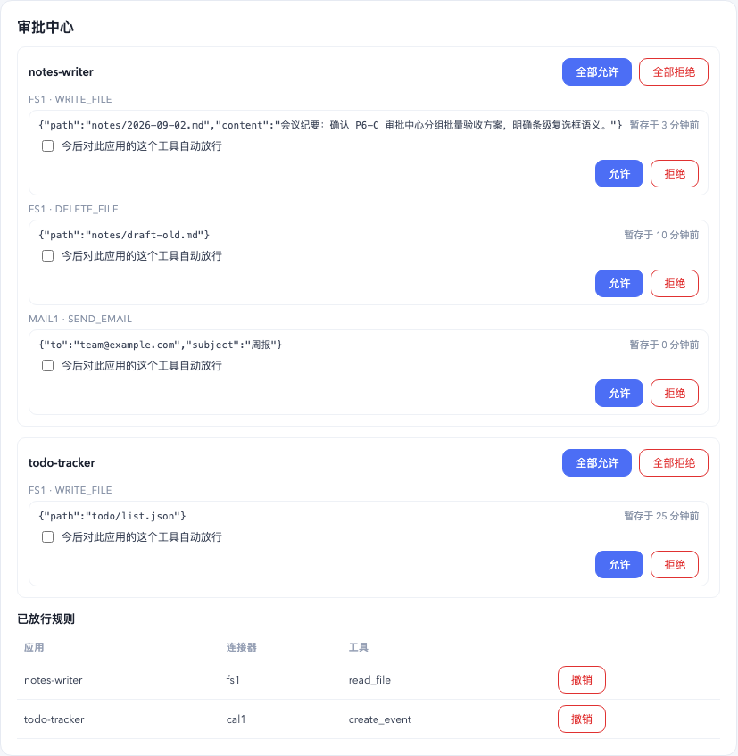

# Super Agent OS

把每个 AI agent 当作一个**应用**来安装、授权、沙盒运行和互联的 macOS 桌面宿主。每个应用是一个独立的 [pi](https://github.com/earendil-works/pi) 子进程，宿主用 Rust（Tauri 2）负责权限、沙盒、连接器、调度与应用间调用；前端是 React 18。



## 项目状态与边界（先读这一段）

- **早期开发阶段**：没有发布过安装包，没有代码签名与公证，没有自动更新。目前只适合从源码构建、自己试用和阅读实现。
- **只支持 macOS**：沙盒依赖系统自带的 `sandbox-exec`（苹果已将其标记为弃用，但目前仍可用），密钥依赖系统钥匙串。其它平台没有操作系统级沙盒，第三方应用只能以受限工具集运行，且未经验证，不建议使用。
- **已知的安全边界如实列在** [`docs/known-limitations.md`](docs/known-limitations.md)，威胁模型与漏洞报告方式见 [`SECURITY.md`](SECURITY.md)。

## 它解决什么问题

常见的个人 AI 助手往往把所有能力放在同一个进程里，用一两档粗粒度权限加同步弹窗来审批。弹窗一多，用户很容易直接选「完全访问」；第三方技能和插件带来的供应链风险也随之放大。Super Agent OS 从宿主层面换一种做法：

| 差异点 | 做法 | 状态 |
|---|---|---|
| 同意框说的 = 执行层做的 | 每一类能力是一个 `Capability` 对象，声明、人话呈现、启动期注入、调用期分发、装卸钩子五件事同源；不变式测试钉住「声明必呈现、必执行、字段全覆盖」 | 已实现 |
| 每应用独立沙盒子进程 | macOS `sandbox-exec` 逐应用生成 SBPL profile，只放行自己的数据区、声明过的目录和自己的宿主 socket；越权套件 12/12 | 已实现 |
| 宿主是唯一执行点 | MCP 连接器、通知、应用间调用都经每应用独占的 unix socket 回到宿主，身份取自监听器绑定而不是线上自称 | 已实现 |
| 权限不随调用链放大 | 应用 A 调应用 B 时，B 用自己的清单启动，调用深度上限 3，白名单闸 | 已实现 |
| 异步批量审批 | 写操作暂存、agent 继续跑、用户在审批中心批量验收，结果回送会话；放行规则持久化可撤销；连接器分 byo / vetted，byo 下不再信任 server 自报的只读注解（工具名前缀表仍是启发式，见已知边界） | 已实现 |
| 开放技能标准 | 兼容 Agent Skills（`SKILL.md`）；宿主是唯一技能来源（子进程 `--no-skills` + 逐个 `--skill`），安装门做 frontmatter 校验、危险模式扫描、`allowed-tools` 子集校验与信任分级；来源：内置 / 本地目录 / 市场 zip（sha256、https-only）/ 应用工坊生成（待用户确认） | 已实现 |
| 多模型 BYOK | 密钥进系统钥匙串；多家 provider（含国内）、全局 / 按应用选模型、连通性测试 | 已实现 |
| 资源可见、按需启停 | 每应用进程内存 / CPU 面板、空闲回收 | 计划中 |

## 架构一览

```
┌──────────────────────── Tauri 宿主（Rust，src-tauri/） ────────────────────────┐
│ CapabilityRegistry ── 内置能力：ui_emit / connectors / agents.call / router     │
│                        maker / system.schedule / system.notifications /        │
│                        filesystem / ui.connectSrc / skills                     │
│ install.rs（包校验、同意框、装卸钩子） · permissions.rs（清单 v2）                │
│ session_mgr.rs（拉起 pi --mode rpc，合成 --tools 白名单）· sandbox.rs（SBPL）     │
│ mcp_socket.rs（每应用 unix socket，分发到能力对象，拒绝也审计）                    │
│ mcp.rs（连接器进程池、危险分级、写确认）· call_bus.rs（应用间调用三闸）            │
│ scheduler（cron + 并发闸门）· notifications · audit · secrets（Keychain）          │
└──────────────┬───────────────────────────────────────────────┬─────────────────┘
               │ stdin/stdout JSON-RPC                          │ unix socket
   ┌───────────▼───────────┐  ┌───────────▼───────────┐   ┌────▼──────────────┐
   │ 应用 A：pi 子进程       │  │ 应用 B：pi 子进程       │   │ hosttools/*.ts     │
   │ sandbox-exec 沙盒       │  │ sandbox-exec 沙盒       │   │ pi 扩展，把宿主工具 │
   │ 只见自己的数据区        │  │ 只见自己的数据区        │   │ 暴露给模型          │
   └────────────────────────┘  └────────────────────────┘   └────────────────────┘
                     ▲ WebView（React，src/）：应用栅格、会话面板、同意框、能力面板、
                       连接器设置、通知中心、审批中心、审计视图、市场、技能库
```

一个应用 = 一个目录：`package.json`（`superagent` 块声明入口、模型、工具）+ `permissions.json`（清单 v2）+ `agent/persona.md` + 可选 `ui/`。范例见 [`samples/`](samples/)。

## 快速开始（开发模式）

前置：macOS、Rust 稳定版工具链、Node 20+、PATH 上有 pi（`npm i -g @earendil-works/pi-coding-agent`，或用下面的独立二进制）。

```bash
npm ci && (cd src-tauri/hosttools && npm ci)
./scripts/fetch-pi.sh          # 可选：下载 pi 官方独立二进制到 src-tauri/binaries/pi/，不依赖 Node
npm run tauri dev
```

首次启动进入引导向导：填入模型服务的 API key（写入系统钥匙串，不落文件）→ 装一个起步应用（建议「待办便签」或「应用工坊」）→ 进入主界面。应用头部的「权限」按钮可查看该应用声明了哪些能力以及每项在哪一层强制。

指定 pi 二进制：`SUPERAGENT_PI_BIN=/path/to/pi npm run tauri dev`。解析顺序：环境变量 → 随包资源 → `src-tauri/binaries/pi/pi` → PATH。

## 打包

```bash
npm run tauri build            # beforeBuildCommand 会先跑 npm run build 与 scripts/fetch-pi.sh
```

产物内置 pi 独立二进制（版本取 `src-tauri/pi-version.txt`），运行机器不需要安装 Node 或 pi。打包产物未签名，在别的机器上首次打开会被 Gatekeeper 拦截。

## 验证

```bash
./scripts/ci-local.sh                    # 与 GitHub Actions 完全同一份门禁
./scripts/ci-local.sh --skip-install     # 本地反复跑
cd src-tauri && cargo test --test sandbox_escape_it            # 越权套件
cd src-tauri && cargo test --test real_pi_bash_escape_it \
  --test real_pi_tools_allowlist_it -- --ignored                # 真实 pi 在沙盒下的回归
```

## 安全模型（摘要）

- 第三方应用、技能与应用工坊产物一律 `trusted=false`，在受限沙盒里运行。
- 清单即上界：运行时可用能力 ⊆ 清单声明 ∩ 宿主授予，没有「声明了不执行」或「执行了没声明」的字段。
- 身份与控制值永不取自 wire；fail-closed（审批无人应答 = 拒，沙盒不可用 = 不放宽，审计写不进 = 拒）。
- 连接器自称的「只读」注解不可信，宿主按危险分级二次复核，写操作要用户确认。

细节见 [`SECURITY.md`](SECURITY.md)，尚未解决的边界见 [`docs/known-limitations.md`](docs/known-limitations.md)。

## 目录导览

| 路径 | 内容 |
|---|---|
| `src-tauri/src/` | 宿主内核（Rust）；`capabilities/` 下每个文件是一个能力 |
| `src-tauri/hosttools/` | 注入 pi 的 TypeScript 扩展（宿主工具桥） |
| `src-tauri/tests/` | 集成测试；`*_escape_it.rs` 是安全边界套件 |
| `src/` | React 前端 |
| `samples/` | 范例应用、内置技能与内置市场索引 |
| `scripts/` | 门禁脚本、pi 独立二进制拉取 |
| `docs/` | 已知边界与界面截图 |

代码注释里会引用 `docs/superpowers/…` 之类的路径，那是开发过程中的内部设计文档，目前没有随仓库公开。

## 参与

见 [`CONTRIBUTING.md`](CONTRIBUTING.md)。安全问题请不要开公开 issue，按 [`SECURITY.md`](SECURITY.md) 的方式私下报告。

## 许可证

[Apache License 2.0](LICENSE)，第三方来源声明见 [`NOTICE`](NOTICE)。pi 是独立项目（MIT），构建时由 `scripts/fetch-pi.sh` 从其官方发布页下载，不包含在本仓库里。
